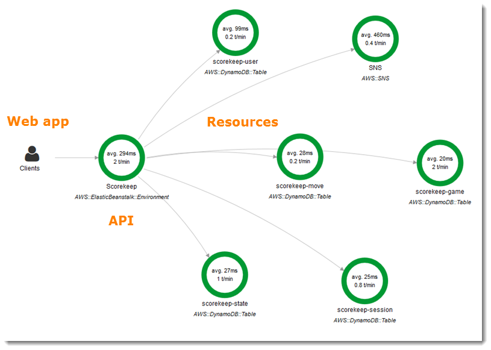

    

### Overview

- lets you analyze & debug applications using distributed tracing
- provides new ways to analyze performance
- lets you see downstream service calls
- works with EC2, Elastic Beanstalk, Elastic Container Service (ECS), Lambda, DynamoDB, etc.
- setup requires X-Ray SDK and X-ray daemon.

### Tutorials

- [Announcing AWS X-Ray](https://www.youtube.com/watch?v=Td7ZSS8p6DA) (2 minutes)
- [Instrument Applications for AWS X-Ray](https://www.youtube.com/watch?v=JBOo2L4sqt8) (10 minutes)

### Documentation

- [Official Documentation](https://docs.aws.amazon.com/xray/latest/devguide/aws-xray.html) - use as a reference
