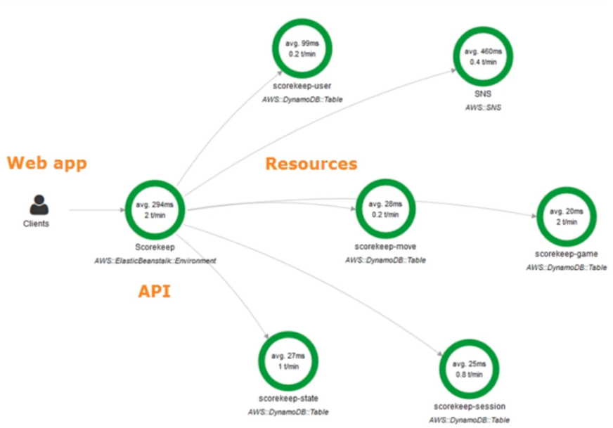

    

### Overview

- lets you analyze & debug applications using distributed tracing
- provides new ways to analyze performance
- lets you see downstream service calls within your function

### Tutorials

- [Announcing AWS X-Ray](https://www.youtube.com/watch?v=Td7ZSS8p6DA) (2 minutes)
- [Instrument Applications for AWS X-Ray](https://www.youtube.com/watch?v=JBOo2L4sqt8) (10 minutes)
